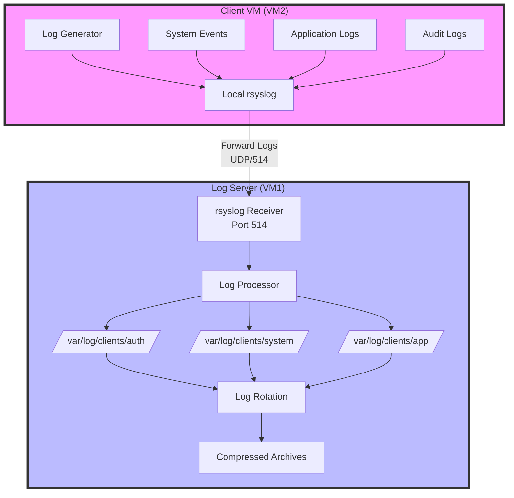
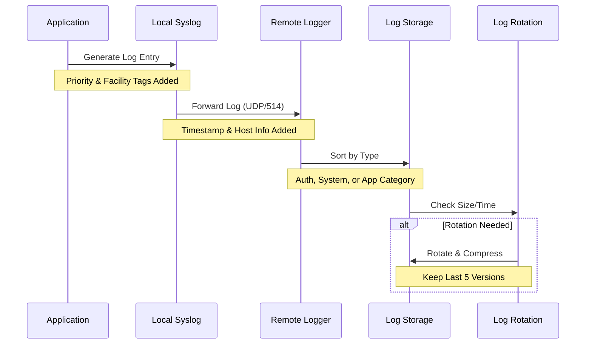
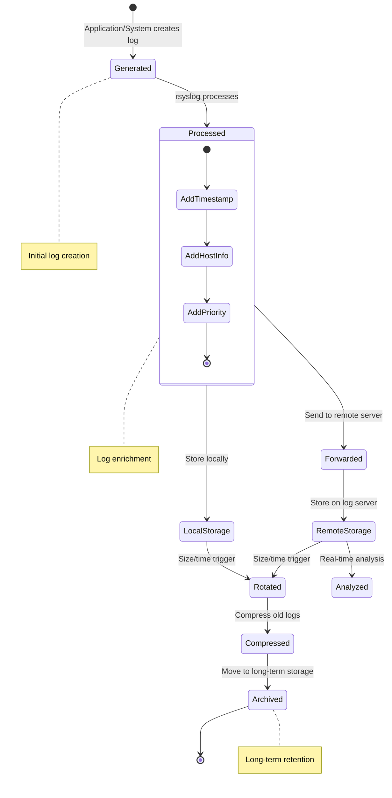
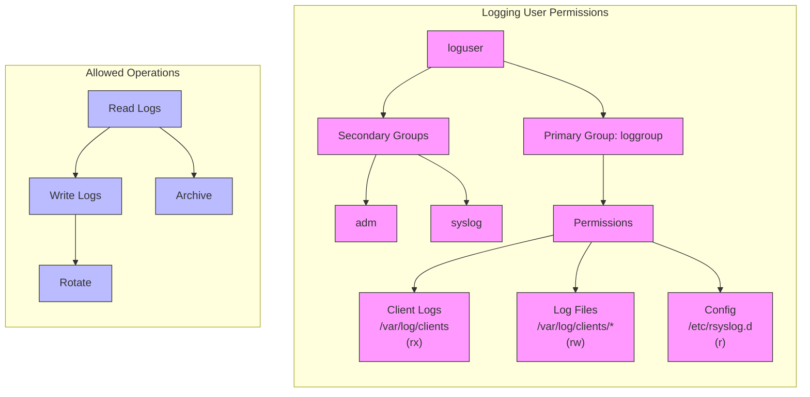

First, let's understand the architecture we'll be building. This diagram shows how logs flow through our system:



The above diagram shows how logs are generated, processed, and stored in our two-VM setup. Notice how all logs from VM2 are forwarded to VM1 for centralized processing and storage.

The following sequence diagram shows how individual log entries are processed:



This sequence shows the journey of each log entry from creation to storage.

Finally, here's a state diagram showing all possible states a log entry can be in:



And here's our user permissions structure:



# Let's first explore where logs live
```bash
cd /var/log
ls -la
```

# What processes are writing logs right now?
```bash
sudo lsof | grep /var/log
```


# Create a simple script that generates interesting logs
```bash
cat << 'EOF' > ~/log_generator.sh
#!/bin/bash
while true; do
    # Simulate different types of events
    case $((RANDOM % 4)) in
        0) logger -p auth.info "User login successful from $(shuf -n 1 /etc/hosts)";;
        1) logger -p kern.warning "High CPU usage detected: $((50 + RANDOM % 50))%";;
        2) logger -p daemon.error "Database connection timeout after 30s";;
        3) logger -p syslog.info "Backup completed successfully, $(date)";;
    esac
    sleep $((2 + RANDOM % 5))
done
EOF

chmod +x ~/log_generator.sh
```
~/log_generator.sh &


# Install and configure rsyslog for remote reception
```bash
sudo apt update
sudo apt install rsyslog
```

# Use the dedicated logging user for operations
```bash
sudo chown -R loguser:loggroup /var/log/clients
sudo chmod -R 750 /var/log/clients
```

# Create a new configuration file
```bash
sudo nano /etc/rsyslog.d/client-sorting.conf
```

# Add intelligent log routing rules
```bash
if $fromhost-ip startswith '192.168.' then {
    auth.* /var/log/clients/auth/auth.log
    kern.* /var/log/clients/system/kern.log
    *.* /var/log/clients/app/catch-all.log
    stop
}
```

# Set specific rsyslog permissions
```bash
sudo chown loguser:loggroup /etc/rsyslog.d/client-sorting.conf
sudo chmod 640 /etc/rsyslog.d/client-sorting.conf
```

# Create a size-based rotation for high-volume logs
```bash
sudo nano /etc/logrotate.d/high-volume
/var/log/clients/app/*.log {
    size 50M
    rotate 5
    compress
    delaycompress
    notifempty
    create 0640 loguser loggroup
    postrotate
        systemctl reload rsyslog
    endscript
}
```

# Create monitoring directory with proper permissions
```bash
sudo mkdir -p /opt/monitoring
sudo chown loguser:loggroup /opt/monitoring
sudo chmod 750 /opt/monitoring
```

# Create the dashboard script
```bash
sudo nano /opt/monitoring/log_dashboard.sh
```

# Set proper permissions
```bash
sudo chown loguser:loggroup /opt/monitoring/log_dashboard.sh
sudo chmod 750 /opt/monitoring/log_dashboard.sh
```

# Install required utilities
```bash
sudo apt install -y gawk bc sysstat net-tools
```

# Verify installation
```bash
which awk bc sar netstat
```

# Ensure loguser has read access to all required logs
```bash
sudo setfacl -R -m u:loguser:rx /var/log/clients/
sudo setfacl -R -m u:loguser:rx /var/log/audit/
#setfacl: /var/log/audit/: No such file or directory
```

# Method 1: Run in current terminal
```bash
sudo -u loguser /opt/monitoring/log_dashboard.sh
```

# Make a log file
```bash
sudo nano /opt/monitoring/log_dashboard.sh

#!/bin/bash
# log_dashboard.sh - Real-time Log Analysis Dashboard


# Colors for better visibility
RED='\033[0;31m'
GREEN='\033[0;32m'
YELLOW='\033[1;33m'
NC='\033[0m' # No Color

# Function to clear screen and show header
show_header() {
    clear
    echo -e "${GREEN}=== Real-time Log Analysis Dashboard ===${NC}"
    echo "Last Updated: $(date '+%Y-%m-%d %H:%M:%S')"
    echo "----------------------------------------"
}

# Function to count events by severity
analyze_logs() {
    local log_file=$1
    local minutes=$2
    
    # Get timestamp from X minutes ago
    local time_threshold=$(date -d "$minutes minutes ago" '+%s')
    
    # Analysis results
    local error_count=0
    local warning_count=0
    local info_count=0
    local auth_failures=0
    
    while IFS= read -r line; do
        # Convert log timestamp to epoch
        local log_time=$(date -d "$(echo "$line" | awk '{print $1" "$2" "$3}')" '+%s' 2>/dev/null)
        
        # Only process recent logs
        if [[ $log_time -ge $time_threshold ]]; then
            if echo "$line" | grep -q "ERROR"; then
                ((error_count++))
            elif echo "$line" | grep -q "WARNING"; then
                ((warning_count++))
            elif echo "$line" | grep -q "INFO"; then
                ((info_count++))
            fi
            
            # Count authentication failures
            if echo "$line" | grep -q "authentication failure"; then
                ((auth_failures++))
            fi
        fi
    done < "$log_file"
    
    # Display results
    echo -e "${RED}Errors (last $minutes min): $error_count${NC}"
    echo -e "${YELLOW}Warnings (last $minutes min): $warning_count${NC}"
    echo -e "${GREEN}Info (last $minutes min): $info_count${NC}"
    echo "----------------------------------------"
    echo -e "Authentication Failures: $auth_failures"
    
    # Calculate rates
    local total=$((error_count + warning_count + info_count))
    if [ $total -gt 0 ]; then
        local error_rate=$(( (error_count * 100) / total ))
        echo "Error Rate: ${error_rate}%"
    fi
}

# Function to show top IP addresses
show_top_ips() {
    echo "----------------------------------------"
    echo "Top Source IPs (last hour):"
    grep -oE "\b([0-9]{1,3}\.){3}[0-9]{1,3}\b" "$1" | sort | uniq -c | sort -nr | head -5
}

# Function to monitor disk usage
check_disk_usage() {
    echo "----------------------------------------"
    echo "Log Storage Status:"
    df -h /var/log | tail -n 1 | awk '{print "Used: "$5" of "$2" ("$3" used, "$4" free)"}'
}

# Main loop
main() {
    local log_file="/var/log/clients/app/catch-all.log"
    local refresh_rate=10 # seconds
    
    while true; do
        show_header
        analyze_logs "$log_file" 5  # Show last 5 minutes
        show_top_ips "$log_file"
        check_disk_usage
        
        echo "----------------------------------------"
        echo "Press Ctrl+C to exit. Refreshing every ${refresh_rate}s..."
        sleep $refresh_rate
    done
}

main
```
```bash
sudo chmod +x /opt/monitoring/log_dashboard.sh
```


# Create a systemd service for automatic startup
```bash
sudo nano /etc/systemd/system/log-dashboard.service

#!/bin/bash
[Unit]
Description=Log Analysis Dashboard
After=rsyslog.service

[Service]
Type=simple
User=loguser
Group=loggroup
ExecStart=/opt/monitoring/log_dashboard.sh
Restart=always
StandardOutput=journal
StandardError=journal

[Install]
WantedBy=multi-user.target

# Enable and start the service
sudo systemctl daemon-reload
sudo systemctl enable log-dashboard
sudo systemctl start log-dashboard

# Check status
sudo systemctl status log-dashboard

# Install lightweight web server
sudo apt install nginx

# Create web dashboard wrapper
sudo nano /opt/monitoring/web_dashboard.sh
#!/bin/bash
while true; do
    /opt/monitoring/log_dashboard.sh | \
        ansi2html > /var/www/html/dashboard.html
    sleep 10
done
```

# Set up web access
```bash
sudo nano /etc/nginx/sites-available/dashboard
server {
    listen 8080;
    root /var/www/html;
    location / {
        auth_basic "Log Dashboard";
        auth_basic_user_file /etc/nginx/.htpasswd;
    }
}
```

# Create dashboard user
```bash
sudo apt install apache2-utils
sudo htpasswd -c /etc/nginx/.htpasswd dashboard_user
```

# Enable site
```bash
sudo ln -s /etc/nginx/sites-available/dashboard /etc/nginx/sites-enabled/
sudo nginx -t
sudo systemctl restart nginx
```

# Limit dashboard access to specific IPs
```bash
sudo nano /etc/hosts.allow
dashboard: 192.168.8.159/24
```

# Deny all other access
```bash
sudo nano /etc/hosts.deny
dashboard: ALL
```

# Create access log
```bash
sudo touch /var/log/dashboard_access.log
sudo chown loguser:loggroup /var/log/dashboard_access.log
```

# Add to dashboard rotation
```bash
sudo nano /etc/logrotate.d/dashboard
/var/log/dashboard_access.log {
    daily
    rotate 7
    compress
    delaycompress
    missingok
    create 0640 loguser loggroup
}
```

#kui lahen lehele saan sisse logitud aga tuleb forbidden ette

# Install auditd
```bash
sudo apt install auditd
```

# Create focused audit rules
```bash
sudo auditctl -w /etc/passwd -p wa -k user_changes
sudo auditctl -w /etc/ssh/sshd_config -p wa -k ssh_config
```

# Verify file permissions regularly
```bash
sudo find /var/log/clients -type f -exec stat -c "%n %a %U %G" {} \;
```

# Monitor for permission changes
```bash
sudo auditctl -w /var/log/clients -p wa -k log_security
```

# Enable TLS for log transmission
```bash
# In /etc/rsyslog.conf on both servers:
module(load="imtls")
input(type="imtls" port="6514")
```

# Create a simple audit script

```bash
cat << 'EOF' > ~/audit_logs.sh
#!/bin/bash
echo "=== Log File Permissions Audit ==="
find /var/log/clients -type f -exec stat -c "%n %a %U %G" {} \;
echo "=== Logging User Privileges ==="
sudo -u loguser touch /var/log/clients/test 2>&1
echo "=== Open Log Files ==="
lsof | grep /var/log/clients
EOF
```

# Install inotify-tools
```bash
sudo apt install inotify-tools
```
# Monitor for suspicious access
```bash
inotifywait -m -r /var/log/clients
```
